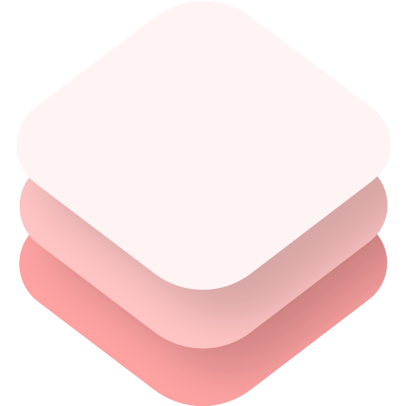

<p align="center">
	
	<br>
	<h3 align="center" style="font-size: 32px; font-weight: 600; margin-bottom: 0px;">ControllerKit</h3>
	<p align="center" style="font-size: 18px;">Responsive controller framework for the web.</p>
	<p align="center">
	<a href="https://zenithdevs.github.io/ControllerKit/demo/">See it in Action</a>
	</p>
	<hr>
</p>
        
### What is ControllerKit?
<p>ControllerKit is a JavaScript library that makes adding controls to your website trivial. ControllerKit supports keyboard, touch, and gamepad inputs right off the bat, so all you have to do is bind and handle the controls.</p>
		
### Getting Started
First things first, let's install it. It's only available on the GitHub Package registry, so you'll need to set that up before you can install.

```shell
$ npm i @zenithdevs/controllerkit
```

Once installed, just import it and make a new instance of the ControllerKit class. The only argument the ControllerKit class takes is options, which is optional. See [API](#api) to learn more.

```js
import ControllerKit from "@zenithdevs/controllerkit";
const controls = new ControllerKit();
```

Now we can listen for inputs by binding the on "change" event handler and running the listen method.

```js
controls.on("change", (controls) => console.log(controls));
controls.listen();
```

### API

ControllerKit was made to be simple and requires little to no configuration. The four lines in the [Getting Started](#getting-started) section may be all you need, but for those who want more customization there's more options here.

For starters, the options object in the ControllerKit constructor. Below is an example that has all the options passed, along with their default values.

```js
new ControllerKit({
  touch: true, // Enable touch input
  keyboard: true, // Enable keyboard input
  gamepad: true, // Enable gamepad input
  deadZone: 0.5, // The deadzone for controller joysticks
  touchQuerySelector: "[data-ck-control]", // The query selector of touch button elements
  bindings, // The bindings object, covered in the "Binding" section
});
```

#### Binding

The valid configuration for the bindings object is:

```ts
type CKInputBindings = {
  [key in CKControl]: {
    keyboard?: number; // A keyCode to bind to.
    gamepadButton?: number; // The button on a controller to bind to.
    gamepadJoystick?: { axis: number; direction: -1 | 1 }; // The axis to bind to as well as the direction (positive 1 or negative 1).
  };
};
```

The valid keys are as follows (as defined by the CKControl type):

```ts
type CKControl =
  | "start"
  | "select"
  | "special"
  | "a"
  | "b"
  | "x"
  | "y"
  | "up"
  | "down"
  | "left"
  | "right"
  | "l_trigger"
  | "l_shoulder"
  | "r_trigger"
  | "r_shoulder"
  | "analog_l_up"
  | "analog_l_down"
  | "analog_l_left"
  | "analog_l_right"
  | "analog_l_press"
  | "analog_r_up"
  | "analog_r_down"
  | "analog_r_left"
  | "analog_r_right"
  | "analog_r_press";
```

#### Event Listeners

There are currently three event listener types:

- "change", passes an object with the input source and it's current state to the event listener.
- "connected", passes a GamepadEvent to the event listener.
- "disconnected", passes a GamepadEvent to the event listener.
